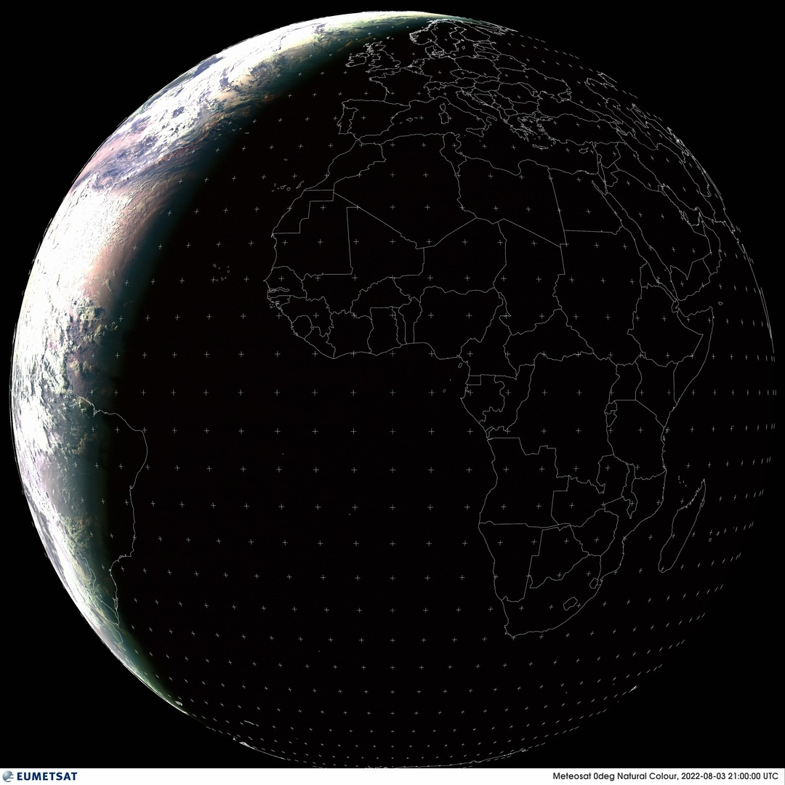

# Latest Earth

Experiment in automating hourly satellite imagery retrieval using github actions.

Currently inactive.

- [x] Himawari-8

  

- [x] GOES-17

  

- [x] GOES-16

  

- [x] Meteosat

    

- [x] Meteosat Indian Ocean

    

## See Also

- https://github.com/ungoldman/goes-bg
- https://github.com/ungoldman/himawari
- https://github.com/ungoldman/himawari-bg
- https://github.com/ungoldman/himawari-urls
- https://github.com/ungoldman/himawari-history

## License

Public Domain ([CC0-1.0](https://spdx.org/licenses/CC0-1.0.html))
